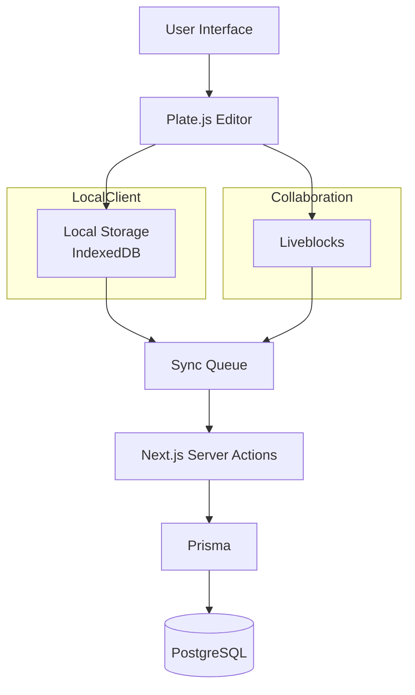

# 熙记 (Xiji) | 基于 Next.js 的实时协同 + AI 辅助写作平台

🏆2025字节跳动工程训练营 Top 30 项目

[English](./README_EN.md) | [简体中文](./README.md)

**熙记 (Xiji)** 希望通过现代 Web 技术打造一个兼具实时协作、离线同步和 AI 辅助能力的下一代笔记平台。

项目重点探索：
- 富文本编辑器工程化
- Local-first 数据同步
- 多人实时协作
- AI 应用前端架构

技术栈：Next.js 14 · TypeScript · Plate.js · Liveblocks · Prisma · IndexedDB · Vercel AI SDK

## 🤩 页面预览

### 登录页
<div align="center">

</div>

### 首页
<div align="center">

</div>

### 笔记页
<div align="center">

</div>

### 编辑器
<div align="center">

</div>

### AI功能
<div align="center">

</div>

## ✨ 核心特性

- **📦 模块化富文本编辑器（@susie/editor）**: 核心编辑器功能剥离为独立的 npm 包 @susie/editor，支持多入口导出、按需加载等功能。
- **🤝 实时协同编辑**: 多人同时编辑同一文档，同步更新文档最新情况 (Powered by Liveblocks Storage API)。
- **⚡️ 本地优先 & 离线支持**: 采用 IndexedDB 进行本地存储，断网状态下依然可用，网络恢复后自动通过同步队列 (Sync Queue) 同步数据。
- **🤖 AI 智能辅助**: 结合自定义 DeepSeek 集成实现润色、总结等高级指令。
- **📱 移动端支持**: 提供 Android App 版本，支持在移动端实时协作编辑。
- **📝 强大的富文本编辑器**: 基于 Plate.js (Slate) 构建，支持 Markdown 语法、快捷指令 (Slash Command)、代码块高亮及媒体嵌入。
- **📂 灵活的组织结构**: 支持无限层级文件夹与多标签 (Many-to-Many) 分类系统。
- **🌟 其他熙记特色功能**: “小希冀”板块：支持创建带时间轴的心愿笔记，直观呈现心愿实现过程。回忆胶囊: 独特的时空投递功能。

## 📱 移动端体验 (Android App)

为了让记录随时随地发生，熙记现已推出 Android 客户端。基于 **Capacitor** 构建，将 Web 端的强大功能封装于原生体验之中，让每一份“希冀”触手可及。

- **🔄 无缝同步**: 无论是在电脑前还是旅途中，您的笔记数据通过云端实时互通。
- **🎨 沉浸体验**: 针对移动端优化的手势操作与响应式布局，支持沉浸式状态栏与刘海屏适配。
- **🔐 原生级登录**: 集成 Clerk 身份验证，支持在 App 内部流畅登录，无需跳转外部浏览器。

## 🛠 技术栈

### 核心架构

- **框架**: Next.js 14 (App Router, Server Actions)
- **移动端**: Capacitor 6 (Android)
- **语言**: TypeScript (严格类型检查)
- **数据库**: PostgreSQL (Supabase) + Prisma ORM
- **身份认证**: Clerk

### 编辑器与协作

- **富文本引擎**: Plate.js / Slate.js
- **编辑器组件包**: `@susie/editor` (独立 npm 包，支持模块化引入)
- **实时协作**: Liveblocks (Storage API)
- **状态管理**: Zustand (全局), React Context (局部)

### 离线与存储

- **本地数据库**: IndexedDB (idb)
- **文件存储**: UploadThing
- **同步机制**: 自研双向同步队列 (Optimistic UI 更新)

### UI/UX

- **组件库**: Shadcn/ui (Radix UI + Tailwind CSS)
- **动画**: Framer Motion
- **通知**: Sonner

---

## 💡 技术亮点与难点解析

### 1. 模块化富文本编辑器设计（@susie/editor）

**挑战：**  
随着编辑能力不断扩展，编辑器功能与业务代码逐渐耦合，导致复用和维护成本增加。

**方案：**
- 将基于 Plate.js 构建的编辑器核心能力抽离为独立 npm 包，实现编辑能力与业务应用解耦。
- 设计多入口模块化架构，支持基础编辑、功能插件、协同能力和 UI 组件按需引入。
- 基于 tsup 构建 ESM 模块，并通过 Tree-shaking 优化包体积；使用依赖注入方式解耦 AI 能力与具体业务逻辑。

**效果：**
将编辑器能力从业务应用中解耦，形成独立 npm 包，支持 58 个功能模块按需加载，提高代码复用能力与后续扩展效率。

### 2. 本地优先离线同步架构（Local-first Sync）

**挑战：**  
在弱网或离线环境下，需要保证用户操作连续性，并解决本地数据与服务端状态一致性问题。

**方案：**
- 基于 IndexedDB 构建本地数据层，优先读取本地数据渲染 UI，并在后台完成数据同步。
- 自研 SyncQueue 操作队列，通过乐观更新记录用户增删改操作，网络恢复后自动批量同步至服务端。
- 设计本地 ID 与服务端 ID 映射机制，处理离线创建数据后的状态合并问题，保证客户端与服务端最终数据一致。

**效果：**
实现离线可用与在线同步体验，提升复杂网络环境下的数据可靠性。

### 3. 富文本实时协同编辑（Real-time Collaboration）

**挑战：**  
Plate.js 编辑器内部状态与 Liveblocks 实时存储模型存在差异，容易产生同步循环、内容闪烁等问题。

**方案：**
- 设计本地编辑与远程同步的双向状态控制机制，区分用户输入和远端数据更新。
- 基于 Liveblocks 实现多人状态同步，并结合防抖策略优化高频编辑场景下的数据传输。
- 针对弱网环境增加同步保护机制，解决多人编辑场景下状态冲突与同步循环问题，保证内容和用户状态一致。

**效果：**
实现多人实时编辑能力，支持复杂富文本场景下的稳定协作体验。

### 4. AI 辅助写作与前端工程化集成

**挑战：**  
AI 能力需要与编辑器交互流程深度结合，同时保证接口安全性和用户体验。

**方案：**
- 基于 Vercel AI SDK 集成 AI 续写、内容润色和摘要功能。
- 使用 Server Actions 管理 AI 请求与密钥调用，将流式输出处理逻辑收敛至服务端。
- 结合 TypeScript 类型体系设计 AI 插件接口，降低 AI 能力与编辑器核心逻辑的耦合。

**效果：**
构建可扩展的 AI 编辑能力，提高智能功能在真实编辑场景中的可用性。

## 🕸️ 架构图


## 🚀 快速开始

🌐 线上地址：[https://note-platform-seven.vercel.app](https://note-platform-seven.vercel.app)

📱 下载安装包：[https://github.com/Susie0306/xiji-notes/releases](https://github.com/Susie0306/xiji-notes/releases)

### 环境要求

- Node.js 18+
- PostgreSQL 数据库

### 安装步骤

1. **克隆项目**

   ```bash
   git clone https://github.com/Susie0306/xiji-notes.git
   cd xiji-notes
   ```

2. **安装依赖**

   ```bash
   npm install
   # 或
   pnpm install
   ```

3. **配置环境变量**
   复制 `.env.example` 为 `.env` 并填入以下服务密钥：

   ```env
   # Database
   DATABASE_URL="postgresql://..."
   DIRECT_URL="postgresql://..."

   # Auth (Clerk)
   NEXT_PUBLIC_CLERK_PUBLISHABLE_KEY=...
   CLERK_SECRET_KEY=...

   # Collaboration (Liveblocks)
   NEXT_PUBLIC_LIVEBLOCKS_PUBLIC_KEY=...
   LIVEBLOCKS_SECRET_KEY=...

   # File Upload (UploadThing)
   UPLOADTHING_SECRET=...
   UPLOADTHING_APP_ID=...
   ```

4. **数据库迁移**

   ```bash
   npx prisma generate
   npx prisma db push
   ```

5. **启动开发服务器**
   ```bash
   npm run dev
   ```

打开 [http://localhost:3000](http://localhost:3000) 即可访问。

## 📂 目录结构

```
├── app/                    # Next.js App Router 路由与页面
├── components/             # React 组件
├── lib/                    # 工具函数与配置
├── packages/               # Monorepo 子包
│   └── editor/             # @susie/editor 编辑器独立包
└── prisma/                 # 数据库模型 (Schema)
```

## 🤝 贡献

欢迎提交 Issue 或 Pull Request。对于重大变更，请先在 Issue 中进行讨论。

## 📄 许可证

MIT License
