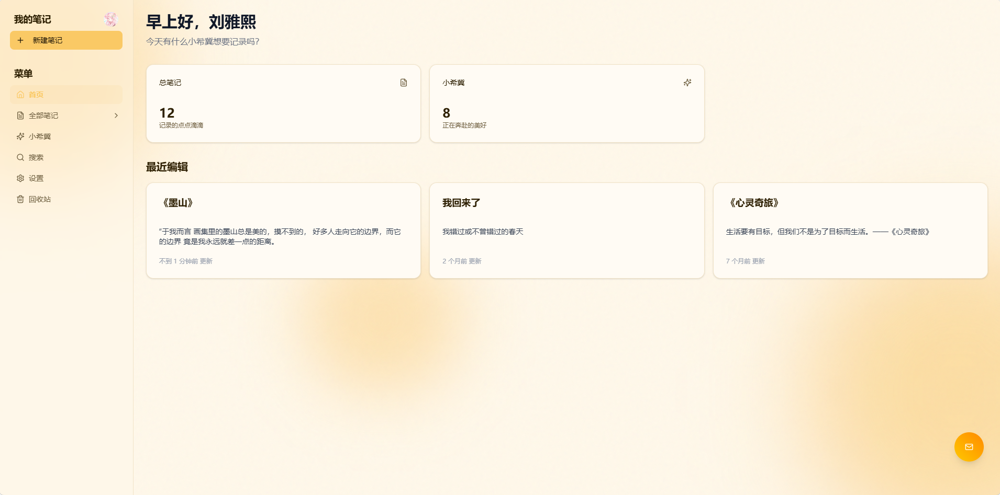
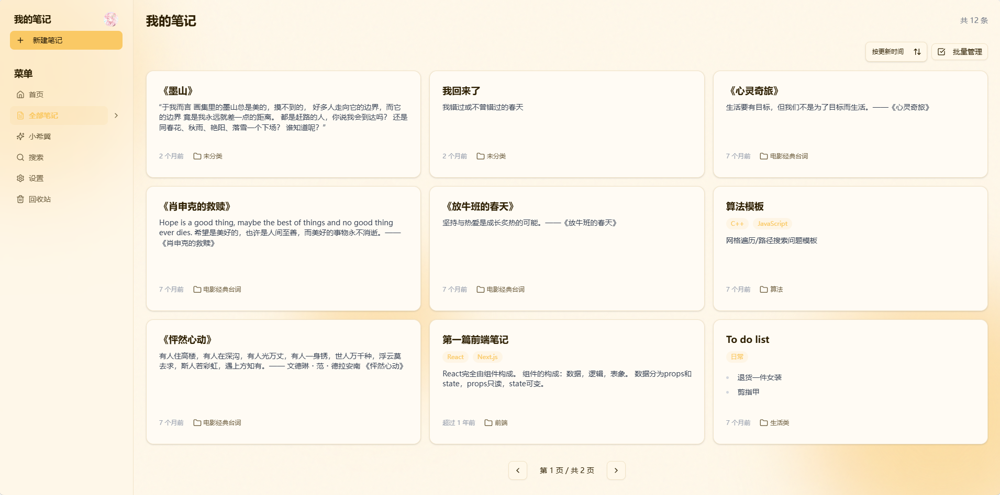
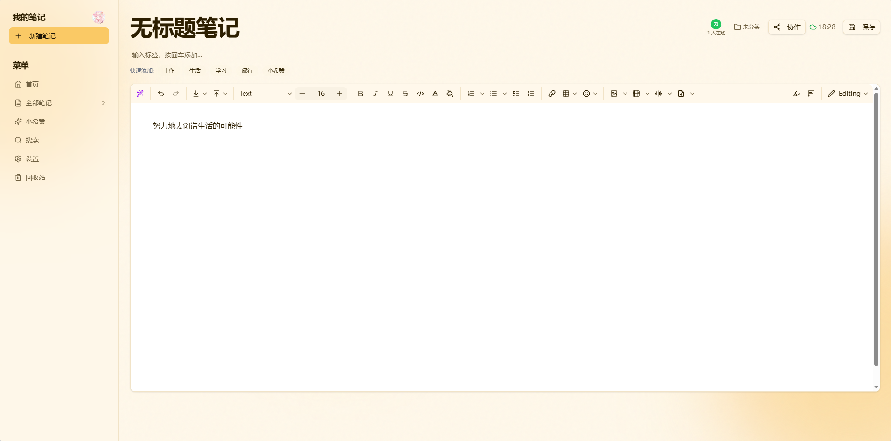
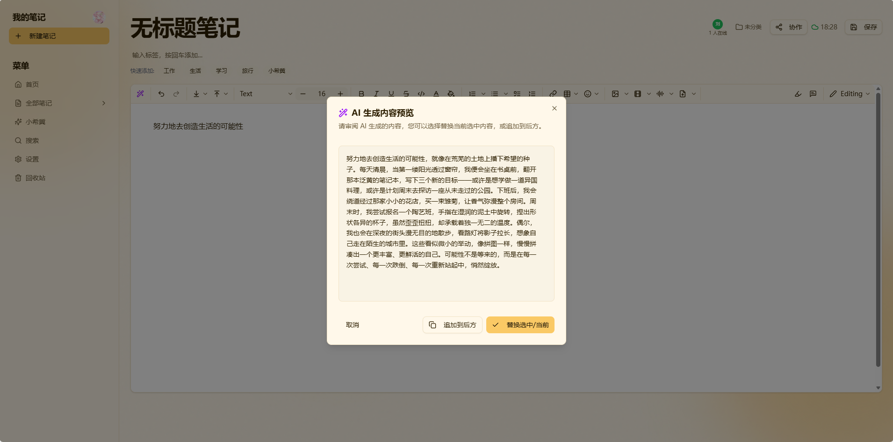
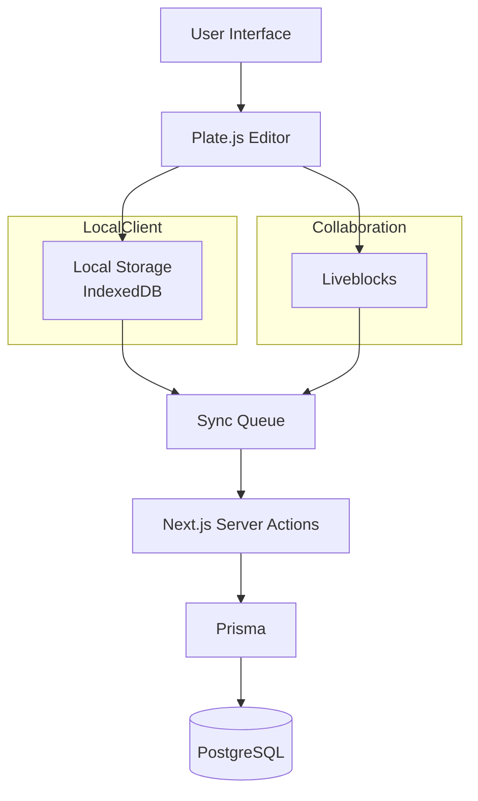

# Xiji (熙记) | Real-time Collaborative + AI-assisted Writing Platform Based on Next.js

🏆2025 ByteDance Engineering Bootcamp Top 30 Project

[English](./README_EN.md) | [简体中文](./README.md)

**Xiji (熙记)** aims to build a next-generation note-taking platform with real-time collaboration, offline synchronization, and AI assistance through modern web technologies.

Project Highlights:
- Rich text editor engineering
- Local-first data synchronization
- Multi-user real-time collaboration
- AI application frontend architecture

Tech Stack: Next.js 14 · TypeScript · Plate.js · Liveblocks · Prisma · IndexedDB · Vercel AI SDK

## 🤩 Preview

### Login Page
<div align="center">

</div>

### Home Page
<div align="center">

</div>

### Note Page
<div align="center">

</div>

### Editor
<div align="center">

</div>

### AI Features
<div align="center">

</div>

## ✨ Core Features

- **📦 Modular Rich Text Editor (@susie/editor)**: Core editor functionality extracted as an independent npm package @susie/editor, supporting multi-entry export and on-demand loading.
- **🤝 Real-time Collaborative Editing**: Multiple users editing the same document simultaneously with synchronized updates (Powered by Liveblocks Storage API).
- **⚡️ Local-first & Offline Support**: Uses IndexedDB for local storage, remaining usable offline, and automatically synchronizing data via a Sync Queue upon network recovery.
- **🤖 AI Intelligent Assistance**: Combines custom DeepSeek integration for advanced commands like polishing and summarization.
- **📱 Mobile Support**: Provides Android App version with real-time collaborative editing on mobile.
- **📝 Powerful Rich Text Editor**: Built on Plate.js (Slate), supporting Markdown syntax, Slash Commands, code block highlighting, and media embedding.
- **📂 Flexible Organization Structure**: Supports infinite nested folders and many-to-many tag classification system.
- **🌟 Other Xiji Features**: "Little Wishes" module: Supports creating wish notes with timelines, visualizing wish achievement process. Memory Capsule: Unique time-delivery feature.

## 📱 Mobile Experience (Android App)

To make recording accessible anytime, anywhere, Xiji is now available on Android. Built with **Capacitor**, it encapsulates the powerful features of the Web into a native experience, making every "wish" within reach.

- **🔄 Seamless Sync**: Real-time cloud synchronization between desktop and mobile.
- **🎨 Immersive Design**: Optimized gestures and responsive layout, supporting immersive status bars and notch adaptation.
- **🔐 Native Auth**: Integrated with Clerk authentication for smooth in-app login without jumping to external browsers.

## 🛠 Tech Stack

### Core Architecture

- **Framework**: Next.js 14 (App Router, Server Actions)
- **Mobile**: Capacitor 6 (Android)
- **Language**: TypeScript (Strict Type Checking)
- **Database**: PostgreSQL (Supabase) + Prisma ORM
- **Authentication**: Clerk

### Editor & Collaboration

- **Rich Text Engine**: Plate.js / Slate.js
- **Editor Package**: `@susie/editor` (Standalone npm package, supporting modular import)
- **Real-time Collaboration**: Liveblocks (Storage API)
- **State Management**: Zustand (Global), React Context (Local)

### Offline & Storage

- **Local Database**: IndexedDB (idb)
- **File Storage**: UploadThing
- **Sync Mechanism**: Self-developed bi-directional sync queue (Optimistic UI Updates)

### UI/UX

- **Component Library**: Shadcn/ui (Radix UI + Tailwind CSS)
- **Animation**: Framer Motion
- **Notifications**: Sonner

---

## 💡 Technical Highlights & Challenge Analysis

### 1. Modular Rich Text Editor Design (@susie/editor)

**Challenge:**  
As editing capabilities expand, editor functionality and business code gradually couple, increasing reuse and maintenance costs.

**Solution:**
- Extract core editor capabilities built on Plate.js into an independent npm package, decoupling editing capabilities from business applications.
- Design multi-entry modular architecture, supporting on-demand import of basic editing, feature plugins, collaboration capabilities, and UI components.
- Build ESM modules based on tsup, optimize package size through Tree-shaking; decouple AI capabilities from specific business logic using dependency injection.

**Effect:**
Decouples editor capabilities from business applications, forming an independent npm package, supporting 58 functional modules for on-demand loading, improving code reusability and subsequent expansion efficiency.

### 2. Local-first Offline Sync Architecture (Local-first Sync)

**Challenge:**  
In weak network or offline environments, need to ensure user operation continuity and solve local data and server state consistency issues.

**Solution:**
- Build local data layer based on IndexedDB, prioritize reading local data for UI rendering, and complete data synchronization in the background.
- Self-develop SyncQueue operation queue, record user CRUD operations through optimistic updates, and automatically batch sync to server upon network recovery.
- Design local ID and server ID mapping mechanism, handle state merging issues after offline data creation, ensuring final data consistency between client and server.

**Effect:**
Achieves offline availability and online synchronization experience, improving data reliability in complex network environments.

### 3. Rich Text Real-time Collaborative Editing (Real-time Collaboration)

**Challenge:**  
There are differences between Plate.js editor internal state and Liveblocks real-time storage model, easily causing sync loops, content flickering, and other issues.

**Solution:**
- Design bidirectional state control mechanism for local editing and remote synchronization, distinguishing user input and remote data updates.
- Implement multi-user state synchronization based on Liveblocks, and optimize data transmission in high-frequency editing scenarios with debounce strategy.
- Add synchronization protection mechanism for weak network environments, solving state conflicts and synchronization loops in multi-user editing scenarios, ensuring content and user state consistency.

**Effect:**
Achieves multi-user real-time editing capabilities, supporting stable collaboration experience in complex rich text scenarios.

### 4. AI-assisted Writing and Frontend Engineering Integration

**Challenge:**  
AI capabilities need to be deeply integrated with editor interaction flow, while ensuring interface security and user experience.

**Solution:**
- Integrate AI continuation, content polishing, and summary features based on Vercel AI SDK.
- Use Server Actions to manage AI requests and key calls, converge streaming output processing logic to the server.
- Design AI plugin interfaces combined with TypeScript type system, reducing coupling between AI capabilities and editor core logic.

**Effect:**
Builds scalable AI editing capabilities, improving the usability of intelligent features in real editing scenarios.

## 🕸️ Architecture Diagram


## 🚀 Quick Start

🌐 Live Demo: [https://note-platform-seven.vercel.app](https://note-platform-seven.vercel.app)

📱 Download Installer: [https://github.com/Susie0306/xiji-notes/releases](https://github.com/Susie0306/xiji-notes/releases)

### Prerequisites

- Node.js 18+
- PostgreSQL Database

### Installation Steps

1. **Clone the Project**

   ```bash
   git clone https://github.com/Susie0306/xiji-notes.git
   cd xiji-notes
   ```

2. **Install Dependencies**

   ```bash
   npm install
   # or
   pnpm install
   ```

3. **Configure Environment Variables**
   Copy `.env.example` to `.env` and fill in the following service keys:

   ```env
   # Database
   DATABASE_URL="postgresql://..."
   DIRECT_URL="postgresql://..."

   # Auth (Clerk)
   NEXT_PUBLIC_CLERK_PUBLISHABLE_KEY=...
   CLERK_SECRET_KEY=...

   # Collaboration (Liveblocks)
   NEXT_PUBLIC_LIVEBLOCKS_PUBLIC_KEY=...
   LIVEBLOCKS_SECRET_KEY=...

   # File Upload (UploadThing)
   UPLOADTHING_SECRET=...
   UPLOADTHING_APP_ID=...
   ```

4. **Database Migration**

   ```bash
   npx prisma generate
   npx prisma db push
   ```

5. **Start Development Server**
   ```bash
   npm run dev
   ```

Open [http://localhost:3000](http://localhost:3000) to access.

## 📂 Directory Structure

```
├── app/                    # Next.js App Router routes & pages
├── components/             # React components
├── lib/                    # Utilities & configuration
├── packages/               # Monorepo packages
│   └── editor/             # @susie/editor standalone package
└── prisma/                 # Database Schema
```

## 🤝 Contribution

Issues and Pull Requests are welcome. For major changes, please discuss them in an Issue first.

## 📄 License

MIT License
